# Lab 7

## Part 1

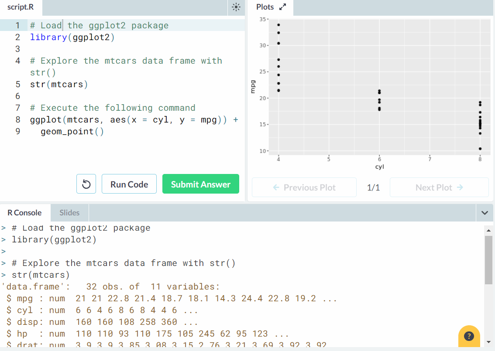

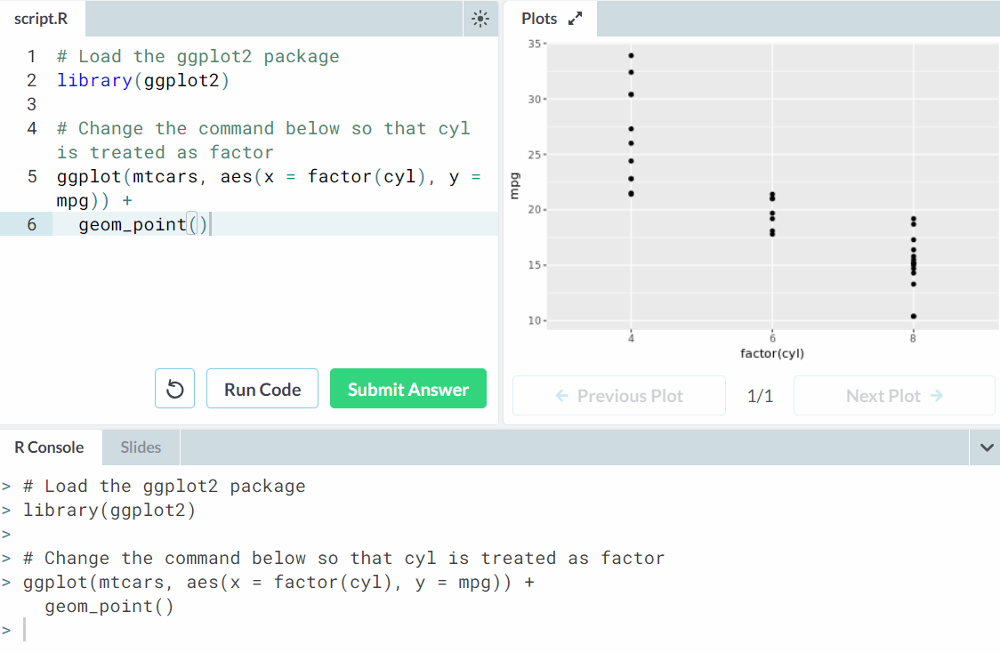

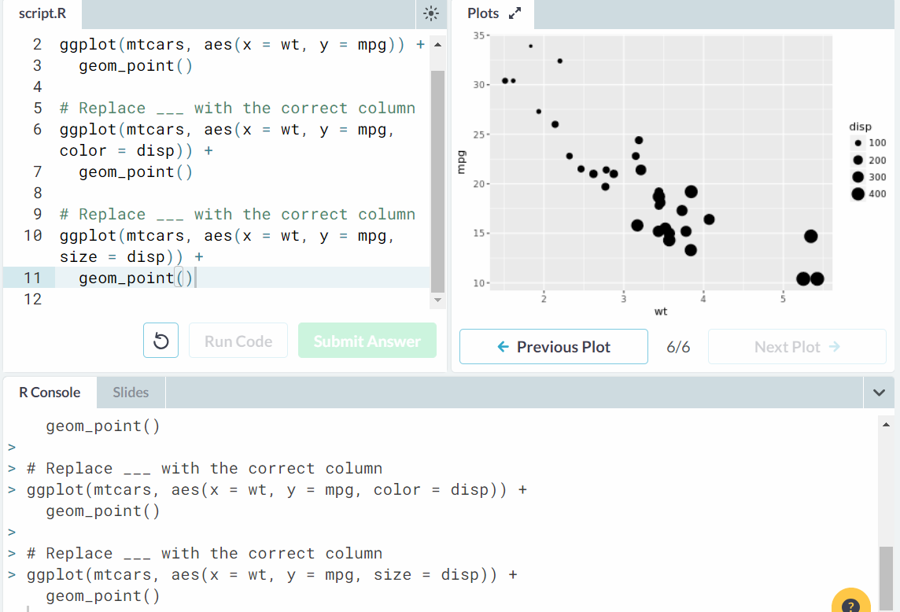

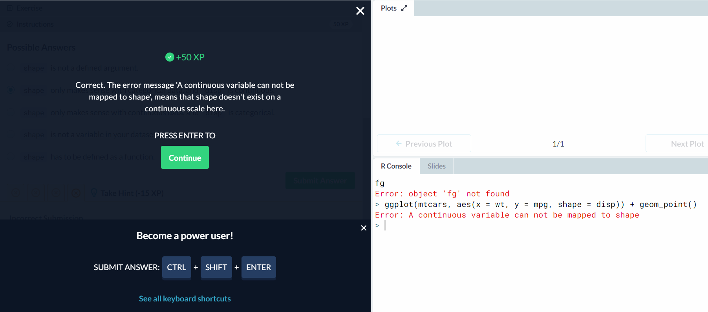

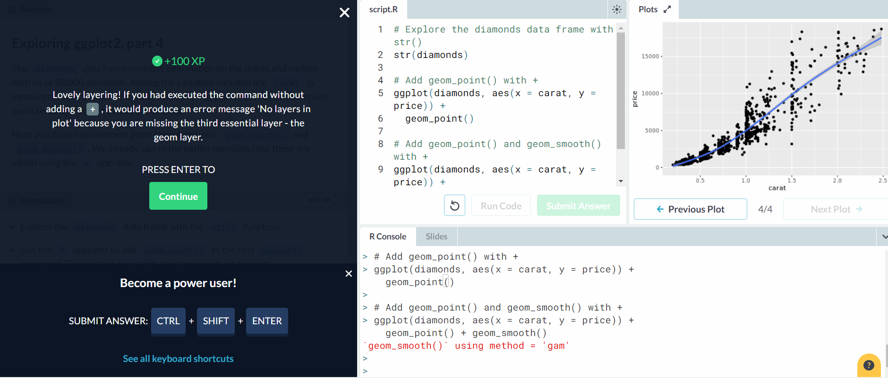

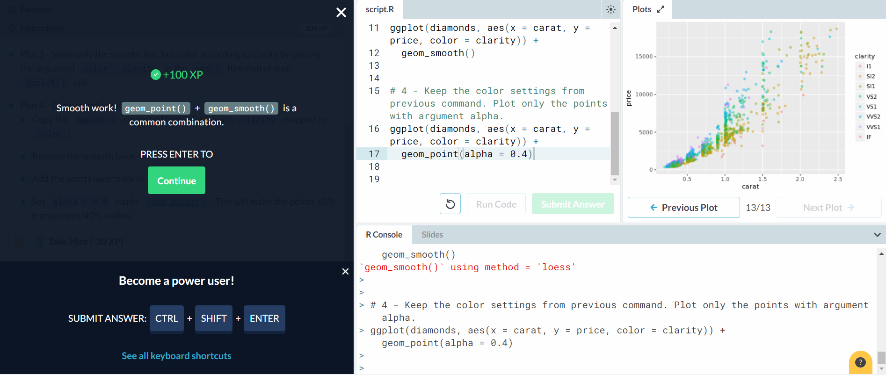

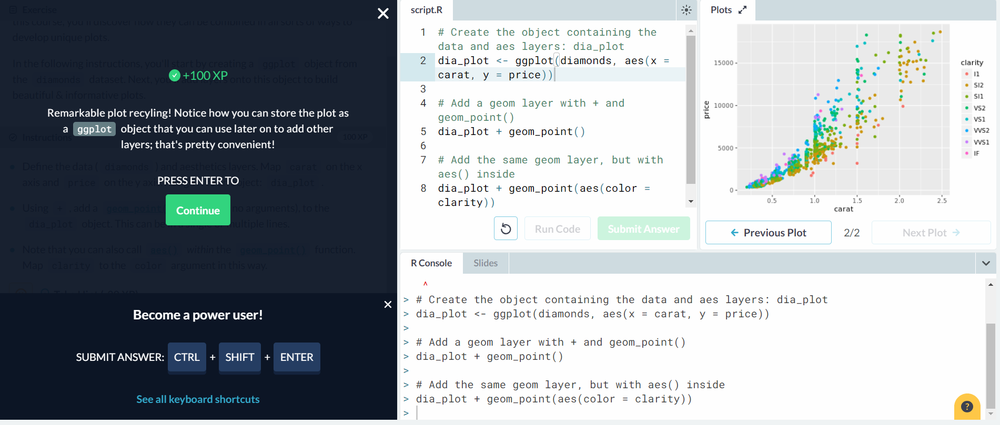

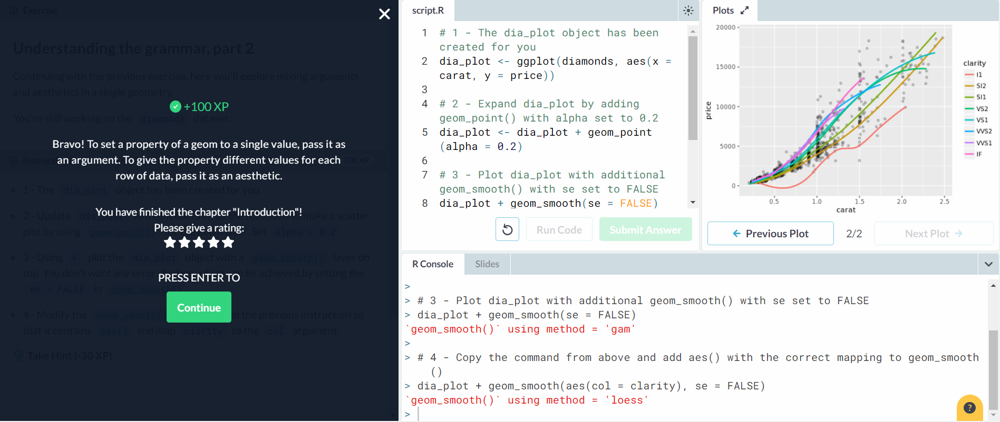

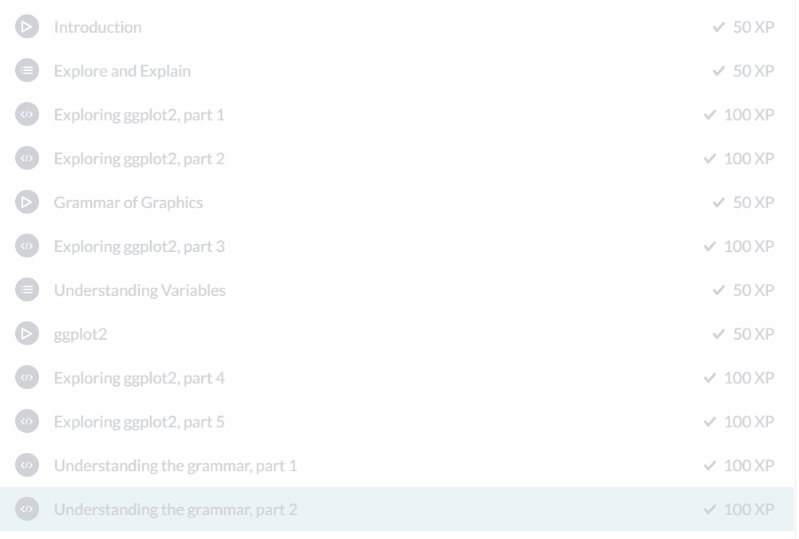

## Part 2

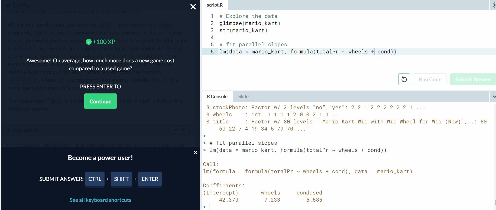

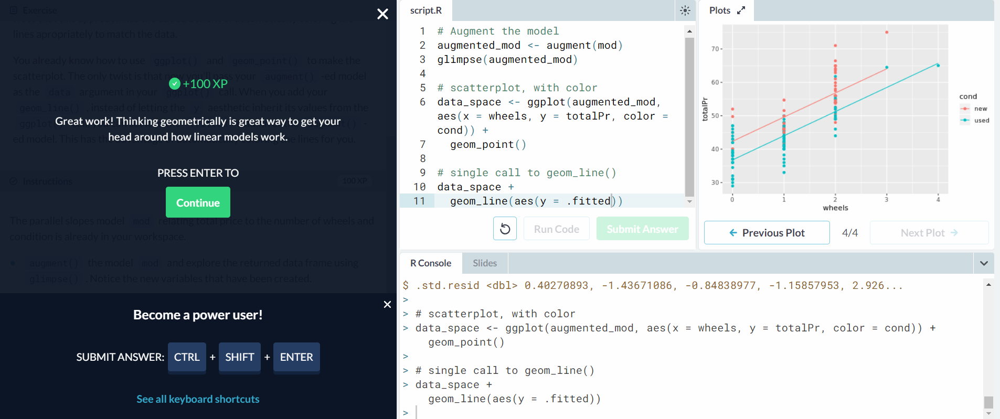

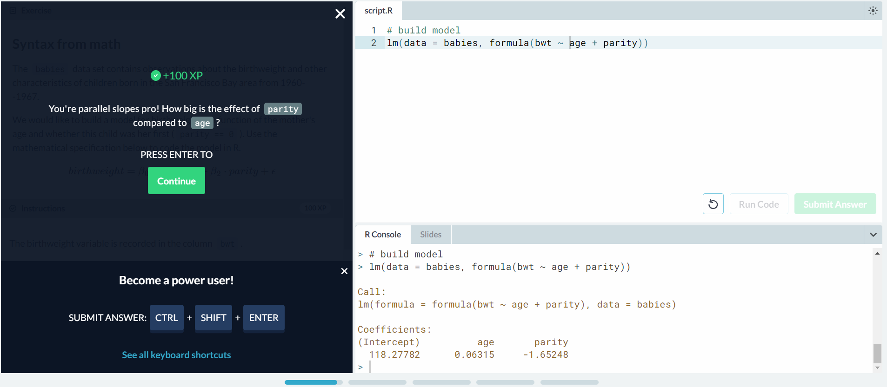

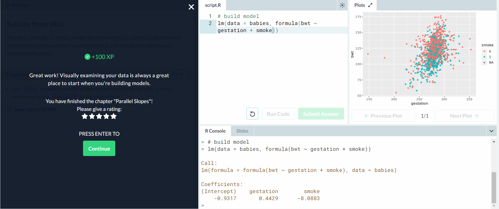

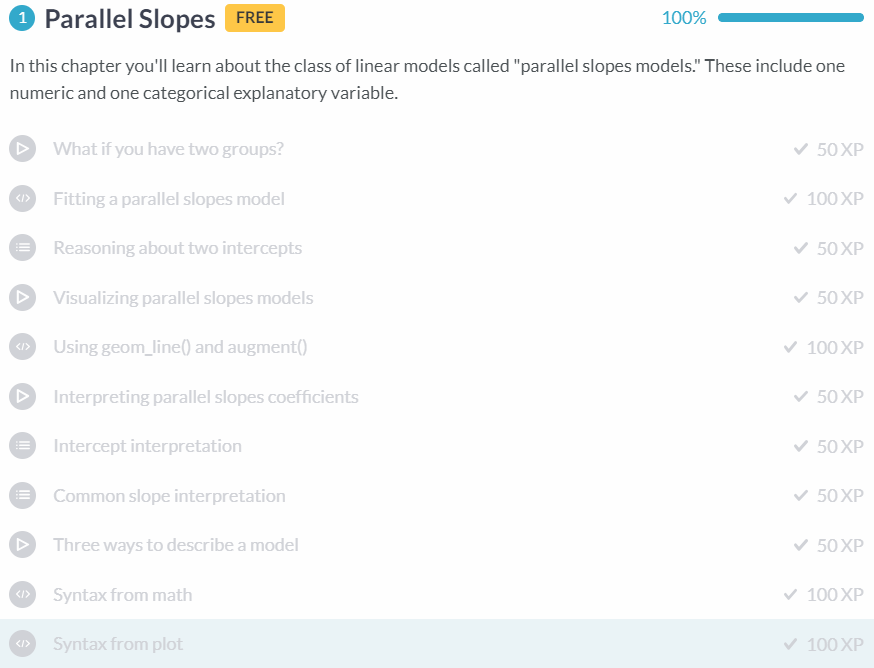

## Part 3

This is an existing RCOS project, so the pages are pre-existing. The "blog" is the status updates page for RCoS, for example.
[Observatory](https://rcos.io/projects/schedj/schedj-frontend/profile)
License: [Apache License 2.0](https://github.com/Schedj/schedj-backend/blob/master/LICENSE)
[Mattermost](https://chat.rcos.io/rcos/channels/schedj)
[Blog Post 1](https://github.com/alanjoy396/Schedj-Blog-for-Open-Source/blob/master/Blog%20Posts/Week_01.md)
